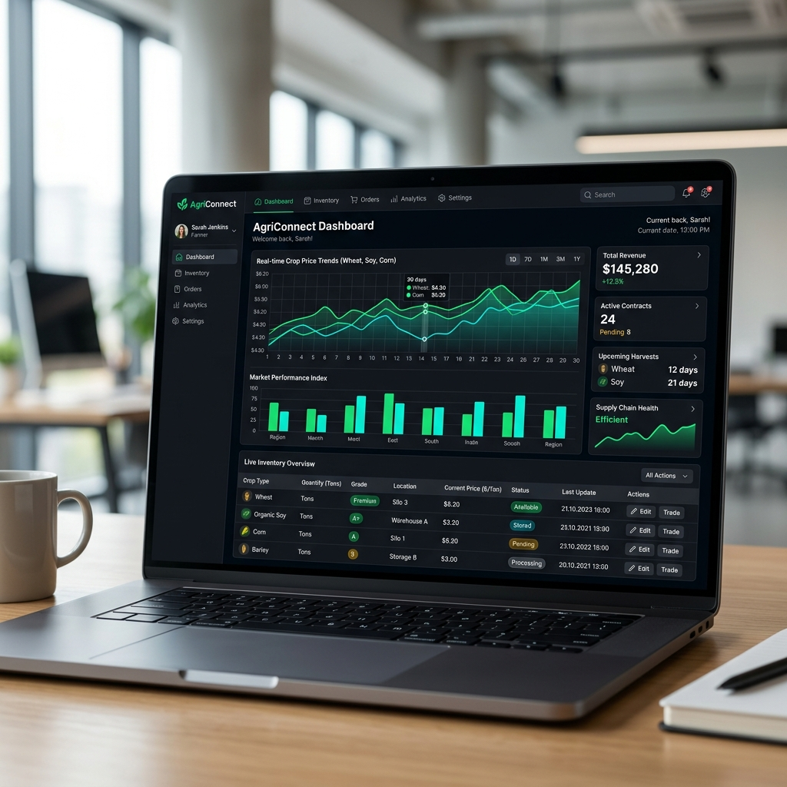

# SAD Professional Portfolio Website



> **University of Vavuniya | Faculty of Technological Studies | Department of ICT**  
> **Course:** System Analysis and Design (SAD) — Individual Assignment (Weight: 50%)  
> **Student Name:** Shehan Hirusha  
> **Registration No:** FTS/ICT/2023/048  
> **Live Web App:** [https://shehanhirusha.github.io/portfolio](https://shehanhirusha.github.io/portfolio)  
> **GitHub Repository:** [https://github.com/shehanhirusha/sad-portfolio](https://github.com/shehanhirusha/sad-portfolio)  
> **LinkedIn Profile:** [linkedin.com/in/shehan-hirusha-33bb52411](https://www.linkedin.com/in/shehan-hirusha-33bb52411?utm_source=share_via&utm_content=profile&utm_medium=member_android)  

---

## 🌟 Overview

This repository contains the complete source code, design assets, PDF curriculum vitae generator, and System Analysis & Design (SAD) report for a modern, mobile-responsive professional portfolio web application. 

The portfolio was engineered to demonstrate core System Development Life Cycle (SDLC) competencies, UML modeling, functional/non-functional requirements specifications, and frontend design excellence guided by the **`ui-ux-pro-max`** design intelligence framework.

---

## 🚀 Key Features

1. **Aurora Dark Glassmorphism Design System**: High-aesthetic visual design with deep radial aurora gradients, glass backdrop filters (`blur(16px)`), micro-animations, and dynamic theme switching (Cinema Dark / Light Glassmorphism).
2. **Typography Hierarchy**: Pairings selected via UI/UX Pro Max skill: *Space Grotesk* for geometric headings, *Archivo* for body text, and *JetBrains Mono* for technical badges.
3. **8 Mandatory SAD Portfolio Sections**:
   - **Home**: Hero banner, introduction, stats, avatar, and quick action CTAs.
   - **About Me**: Professional profile, interests, and career objectives.
   - **Education**: Degree details, cumulative GPA (3.82/4.00), and academic highlights.
   - **Skills**: Filterable competencies (Frontend, SAD & Modeling, Tools, Soft Skills) with animated progress bars.
   - **Projects**: 3 featured case studies (AgriConnect, VavuCampus, Medity) with problem statements, SAD deliverables, tech stack tags, and interactive detail modals.
   - **Experience & Leadership**: Departmental roles, hackathon achievements, peer mentoring, and LinkedIn career sharing evidence.
   - **CV Section**: Embedded online PDF CV viewer modal + direct download trigger.
   - **Contact & Links**: Form with client-side validation, direct email/location details, and toast notifications.
4. **Standalone Professional CV PDF**: Programmatically generated 2-page PDF document (`CV_Kavishka_Perera.pdf`) built using Python ReportLab.
5. **Comprehensive SAD Documentation**: Complete 8-stage SAD report formatted in Markdown (`SAD_Report.md`) and printable HTML (`SAD_Report.html`).

---

## 🛠️ Technology Stack

| Layer | Technologies Used |
| :--- | :--- |
| **Core Web Technologies** | HTML5, CSS3 (Vanilla Custom Properties & Grid/Flexbox), ES6+ JavaScript |
| **Design Framework** | UI/UX Pro Max Skill (Aurora Dark Glassmorphism, Space Grotesk, Archivo, JetBrains Mono) |
| **PDF Generation** | Python 3, ReportLab Library (`generate_cv.py`) |
| **Icons & Media** | FontAwesome 6.4, Custom SVG Canvas Assets |
| **Version Control & Hosting** | Git, GitHub, GitHub Pages |

---

## 📁 Repository Structure

```
.
├── assets/
│   ├── agriconnect_preview.png   # AgriConnect case study UI mockup
│   ├── linkedin_evidence.png     # LinkedIn career post screenshot evidence
│   ├── medity_preview.png        # Medity Tele-Health UI mockup
│   ├── profile_avatar.png        # Professional developer avatar
│   └── vavucampus_preview.png    # VavuCampus portal UI mockup
├── CV_Kavishka_Perera.pdf        # Primary CV PDF document
├── CV.pdf                        # Alternate CV PDF download link
├── generate_cv.py                # Python script to build CV PDF
├── index.html                    # Main semantic HTML5 webpage
├── README.md                     # GitHub repository documentation
├── SAD Portfolio Assignment.pdf   # Assignment specification guidelines
├── SAD_Report.html               # Printable HTML SAD Report for PDF export
├── SAD_Report.md                 # Complete 8-section SAD Report in Markdown
├── script.js                     # Interactive JS logic & toast system
└── styles.css                    # Aurora Glassmorphism CSS design system
```

---

## 💻 Local Setup & Execution

### 1. View Portfolio Web App Locally
No build tools or node servers are strictly required. Simply open `index.html` in any web browser:
- Double-click `index.html` OR
- Run a local HTTP server:
  ```bash
  python -m http.server 8000
  ```
  Then open `http://localhost:8000` in your browser.

### 2. Re-generate CV PDF
If you modify `generate_cv.py`, run:
```bash
python generate_cv.py
```
This will compile an updated `CV_Kavishka_Perera.pdf`.

---

## 📋 Deliverables Mapping (Assignment Requirements)

| Requirement | Deliverable File / Location | Status |
| :--- | :--- | :--- |
| **1. Public Portfolio Web App** | `index.html`, `styles.css`, `script.js` | ✅ Completed |
| **2. GitHub Repository & README** | `README.md` & GitHub repo | ✅ Completed |
| **3. Concise SAD Report (5–8 pages)** | `SAD_Report.md` & `SAD_Report.html` | ✅ Completed |
| **4. Updated CV PDF** | `CV_Kavishka_Perera.pdf` & online modal | ✅ Completed |
| **5. Career-Sharing Evidence** | `assets/linkedin_evidence.png` & section | ✅ Completed |

---

## 👤 Author Information

**K. A. Kavishka Perera**  
Undergraduate ICT Student | Software Developer & System Analyst  
Faculty of Technological Studies | University of Vavuniya, Sri Lanka  
- **Email:** kavishka.perera@vau.ac.lk  
- **LinkedIn:** [linkedin.com/in/kavishkaperera](https://linkedin.com/in/kavishkaperera)  
- **GitHub:** [github.com/kavishkaperera](https://github.com/kavishkaperera)  
