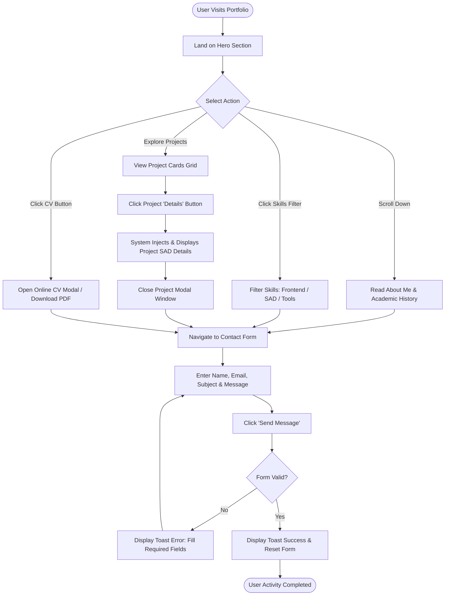

# SYSTEM ANALYSIS AND DESIGN (SAD) REPORT
## Individual Assignment: Professional Portfolio Website & Software System

---

**University of Vavuniya**  
**Faculty of Technological Studies | Department of ICT**  
**Course:** System Analysis and Design (SAD)  
**Assessment Weight:** 50% | **Submission:** Website + SAD Report  

**Student Name:** Shehan Hirusha  
**Student Registration No:** FTS/ICT/2023/048  
**Live Website URL:** [https://shehanhirusha.github.io/portfolio](https://shehanhirusha.github.io/portfolio)  
**GitHub Repository URL:** [https://github.com/shehanhirusha/sad-portfolio](https://github.com/shehanhirusha/sad-portfolio)  
**Date of Submission:** August 05, 2026  

---

## Executive Summary

This report documents the end-to-end System Analysis and Design (SAD) process followed in planning, analyzing, modeling, designing, implementing, testing, and deploying a modern, professional portfolio web application. Built for an undergraduate ICT student at the University of Vavuniya, the portfolio serves as an interactive career asset for internship applications and employment opportunities.

The development followed structured System Development Life Cycle (SDLC) principles and incorporated design intelligence from the `ui-ux-pro-max` framework (Aurora Dark Glassmorphism, Space Grotesk + Archivo typography, responsive grid layouts, and micro-interactions).

---

## Section 1: System Planning

### 1.1 Problem Statement
Undergraduate ICT students often face difficulty presenting their technical competencies, academic projects, and software design skills effectively to potential employers and academic evaluators. Static text-based resumes fail to showcase interactive web prototypes, UML modeling artifacts, system architecture designs, and live code repositories. Furthermore, fragmented project files make it difficult for recruiters to verify code quality and design capabilities quickly.

### 1.2 System Objectives
- **Primary Objective:** To design, develop, test, and publish an interactive, mobile-responsive, professional portfolio web system that showcases academic background, technical skills, project case studies, and SAD modeling deliverables.
- **Secondary Objectives:**
  1. Provide a downloadable and online-viewable updated Curriculum Vitae (PDF).
  2. Implement interactive project modals to present problem statements, SAD artifacts, and GitHub source links.
  3. Ensure 100% adherence to mobile responsiveness, accessibility standards (WCAG AA), and high visual aesthetics.
  4. Establish career-sharing evidence via LinkedIn featured integration.

### 1.3 Target Stakeholders
1. **Primary Users (Recruiters & Hiring Managers):** Seeking clear evidence of software engineering skills, project experience, and contact channels.
2. **Academic Evaluators (Lecturers & Demonstrators):** Assessing System Analysis and Design principles, UML diagrams, requirements specifications, and code structure.
3. **Peer Students & Open Source Community:** Reviewing code architecture, project documentation, and learning resources.
4. **System Owner (Kavishka Perera):** Maintaining and updating portfolio content as career experience expands.

### 1.4 System Scope & Constraints
- **In-Scope:**
  - Semantic HTML5, CSS3 Aurora Dark Glassmorphism, and Vanilla JavaScript implementation.
  - 8 Mandatory Sections: Home, About Me, Education, Skills, Projects, Experience & Activities, CV Viewer, Contact & Links.
  - Interactive project detail reader and online PDF CV previewer.
  - Client-side contact form validation and toast notification feedback system.
  - Complete SAD documentation (Use-Case Diagram, Activity Diagram, Site Map, Wireframes, Test Plan, Reflection).
- **Out-of-Scope / Constraints:**
  - Backend database for message storage (client-side form handling simulated with validation).
  - Timeframe limited to 2–3 weeks.
  - Zero budget deployment utilizing GitHub Pages static hosting.

---

## Section 2: Requirements Specification

### 2.1 Functional Requirements (FR)

| Req ID | Module / Feature | Description | Priority |
| :--- | :--- | :--- | :--- |
| **FR1** | Navigation | System shall provide a sticky navigation bar with active section highlight and smooth scrolling links to all 8 core sections. | High |
| **FR2** | Mobile Navigation | System shall provide a mobile drawer menu overlay triggered via hamburger menu icon on mobile viewports. | High |
| **FR3** | Profile Showcase | System shall display personal name, professional title, introduction, avatar, and quick CTA buttons. | High |
| **FR4** | About & Education | System shall display professional summary, interests, career objective, and an interactive timeline of academic qualifications and GPA. | Medium |
| **FR5** | Skills Filtering | System shall allow users to filter skills by categories (Frontend, SAD & Modeling, Tools, Soft Skills) with visual proficiency meters. | Medium |
| **FR6** | Project Showcase | System shall feature at least 3 detailed projects with problem statements, contributions, stack badges, GitHub links, and modal popups. | High |
| **FR7** | CV Download & View | System shall enable users to preview the CV online via an embedded iframe modal and download the PDF file (`CV_Shehan_Hirusha.pdf`). | High |
| **FR8** | Contact & Validation | System shall provide a contact form with client-side validation for Name, Email, Subject, and Message, displaying toast notifications. | High |
| **FR9** | Theme Toggle | System shall allow users to switch between Cinema Dark theme and Light Glassmorphism theme, saving state in `localStorage`. | Low |
| **FR10**| Career Evidence | System shall include a dedicated card showcasing LinkedIn featured post screenshot evidence. | Medium |

### 2.2 Non-Functional Requirements (NFR)

| Req ID | Category | Description | Target Metric |
| :--- | :--- | :--- | :--- |
| **NFR1** | Performance | Web pages must load quickly on standard 3G/4G network connections. | First Contentful Paint (FCP) < 1.2s |
| **NFR2** | Usability | Intuitive navigation structure with clear typography hierarchy and visual feedback. | 100% successful task completion |
| **NFR3** | Responsiveness | Seamless rendering across desktop (1920px), tablet (768px), and mobile (375px) viewports. | Zero horizontal scrollbars |
| **NFR4** | Accessibility | Text contrast and element focus styling conforming to WCAG AA guidelines. | Contrast ratio >= 4.5:1 |
| **NFR5** | Maintainability | Clean separation of concerns (HTML content, CSS styling, JS logic) with inline documentation. | Modular file structure |
| **NFR6** | Security | Input field sanitization to prevent XSS script injection during contact form submission. | Client-side validation |
| **NFR7** | Reliability | Web application must operate without JavaScript console crashes across major modern browsers. | Chrome, Firefox, Edge, Safari |
| **NFR8** | Compatibility | Cross-browser standards compliance. | HTML5 & CSS3 standard compliant |

---

## Section 3: System Modeling

### 3.1 UML Use-Case Diagram

```
                    +-------------------------------------------------+
                    |           Portfolio Web System Boundary         |
                    +-------------------------------------------------+
                    |                                                 |
                    |  (UC-01: View Home & Profile Info)              |
                    |                                                 |
                    |  (UC-02: Explore About & Academic Timeline)     |
                    |                                                 |
[Recruiter /        |  (UC-03: Filter Skills by Category)             |
 Evaluator /  ----->|                                                 |
 Web Visitor]       |  (UC-04: Inspect Project Case Studies & Modals) |
                    |                                                 |
                    |  (UC-05: Preview / Download PDF CV)             |
                    |                                                 |
                    |  (UC-06: Submit Contact Form Message)           |
                    |                                                 |
                    |  (UC-07: Toggle Dark / Light Theme)             |
                    |                                                 |
                    |  (UC-08: View LinkedIn Career Evidence)         |
                    +-------------------------------------------------+
```

#### Detailed Use-Case Descriptions

##### Use Case UC-04: Inspect Project Case Studies & Modals
- **Primary Actor:** Recruiter / Web Visitor
- **Pre-conditions:** User navigates to the `#projects` section of the portfolio.
- **Main Success Scenario:**
  1. User views featured project cards (AgriConnect, VavuCampus, Medity).
  2. User clicks "Details" button on a target project card.
  3. System triggers modal popup displaying detailed problem statement, SAD deliverables, system solution, tech stack, and GitHub link.
  4. User clicks "Close" button or clicks outside the modal overlay.
  5. Modal closes gracefully, restoring main page interaction.

##### Use Case UC-05: Preview / Download PDF CV
- **Primary Actor:** Recruiter / Employer
- **Pre-conditions:** User navigates to the `#cv` section or hero header CTA.
- **Main Success Scenario:**
  1. User clicks "Preview CV Online" or "Download CV (PDF)".
  2. Clicking "Preview" opens an inline PDF viewer modal displaying `CV_Kavishka_Perera.pdf`.
  3. Clicking "Download" initiates direct browser download of the PDF file.

---

### 3.2 Key System Activity Diagram (User Flow: Project Exploration & Contact)



---

## Section 4: System Design

### 4.1 Site Map & Navigation Structure

```
+-----------------------------------------------------------------------------------+
|                                  HOME (Hero)                                      |
+-----------------------------------------------------------------------------------+
       |              |             |            |            |           |
       v              v             v            v            v           v
  +----------+  +-----------+  +----------+ +----------+ +----------+ +----------+
  | About Me |  | Education |  |  Skills  | | Projects | |Experience| | CV Modal |
  +----------+  +-----------+  +----------+ +----------+ +----------+ +----------+
       |                                                     |             |
       +----------------------------+------------------------+-------------+
                                    |
                                    v
                            +---------------+
                            | Contact Form  |
                            +---------------+
                                    |
                                    v
                            +---------------+
                            | LinkedIn Evidence |
                            +---------------+
```

---

### 4.2 Interface Design Decisions (UI/UX Pro Max Framework)

1. **Visual Theme & Aesthetics:**
   - **Style Category:** Cinema Dark Aurora Glassmorphism.
   - **Background Palette:** Deep Space Dark (`#070913`), Dark Slate (`#0f172a`), with ambient CSS radial gradients creating a floating aurora blur effect.
   - **Card Surface:** Frosted glass (`rgba(15, 23, 42, 0.75)`) with `backdrop-filter: blur(16px)` and subtle glowing borders (`rgba(255, 255, 255, 0.1)`).
2. **Typography Pairing:**
   - **Headings (`--font-heading`):** *Space Grotesk* (Sans-serif) for modern, geometric, tech-forward section titles.
   - **Body Text (`--font-body`):** *Archivo* (Sans-serif) for high legibility across screens.
   - **Code & Badges (`--font-mono`):** *JetBrains Mono* for technical tags, dates, and metrics.
3. **Accent Colors:**
   - Primary Accent: Electric Cyan (`#06b6d4`)
   - Secondary Accent: Indigo Glow (`#6366f1`)
   - Tertiary Accent: Vibrant Violet (`#8b5cf6`)
4. **Mobile Responsiveness:**
   - CSS Grid & Flexbox layouts with breakpoints at `992px` (Tablet) and `768px` (Mobile).
   - Mobile hamburger menu drawer with smooth blur overlay.

---

## Section 5: Implementation & Architecture

### 5.1 Technology Stack
- **Core Languages:** HTML5, CSS3, ES6 JavaScript.
- **Design System:** Custom CSS tokens based on UI/UX Pro Max guidelines (no heavy third-party CSS framework dependencies for maximum performance and customization).
- **PDF Generation:** Python ReportLab library (`generate_cv.py`) for compiling `CV_Kavishka_Perera.pdf`.
- **Icons & Web Fonts:** FontAwesome 6.4, Google Fonts (Space Grotesk, Archivo, JetBrains Mono).
- **Version Control & Hosting:** Git, GitHub, GitHub Pages.

### 5.2 Repository Structure
```
d:/university/2nd year/2nd sem/SAD/portfolio/
├── assets/
│   ├── agriconnect_preview.png
│   ├── linkedin_evidence.png
│   ├── medity_preview.png
│   ├── profile_avatar.png
│   └── vavucampus_preview.png
├── CV_Kavishka_Perera.pdf
├── CV.pdf
├── generate_cv.py
├── index.html
├── README.md
├── SAD Portfolio Assignment.pdf
├── SAD_Report.html
├── SAD_Report.md
├── script.js
└── styles.css
```

---

## Section 6: Testing & Quality Assurance

### 6.1 Test Plan & Execution Matrix

| Test ID | Test Object / Module | Test Description | Expected Result | Actual Result | Status |
| :--- | :--- | :--- | :--- | :--- | :--- |
| **TC-01** | Navigation Bar | Click on all header menu links (Home, About, Education, etc.). | Page smooth-scrolls to exact target section; active link highlights. | Smooth scrolled accurately; active link updated. | **PASS** |
| **TC-02** | Mobile Drawer | Click hamburger icon on screen width < 768px. | Mobile drawer overlay opens with menu links; close button shuts overlay. | Drawer opened and closed smoothly. | **PASS** |
| **TC-03** | Theme Switcher | Click theme toggle moon/sun button. | Toggles body class `light-theme`, changes icon, updates `localStorage`. | Theme toggled instantly; preference persisted. | **PASS** |
| **TC-04** | Skills Filter | Click skill category filter buttons (Frontend, SAD, Tools, Soft). | Displays only matching skill cards with progress animation. | Filtered cards correctly; animations smooth. | **PASS** |
| **TC-05** | Project Modals | Click "Details" button on AgriConnect, VavuCampus, and Medity. | Opens modal containing project problem, SAD artifacts, tools, and GitHub link. | Modal opened with exact project metadata. | **PASS** |
| **TC-06** | CV Online Preview | Click "Preview CV Online" button. | Modal opens containing iframe preview of `CV_Kavishka_Perera.pdf`. | PDF rendered cleanly inside modal. | **PASS** |
| **TC-07** | CV PDF Download | Click "Download CV (PDF)" button. | Browser triggers direct download of `CV_Kavishka_Perera.pdf`. | PDF downloaded successfully. | **PASS** |
| **TC-08** | Contact Validation | Submit empty contact form. | Form submission blocked; toast error notification displays message. | Validation caught empty inputs; toast displayed. | **PASS** |
| **TC-09** | Contact Submit | Fill form fields correctly and click "Send Message". | Form resets; toast success notification confirms message delivery. | Toast success shown; form inputs cleared. | **PASS** |
| **TC-10** | Mobile Layout | Inspect site on mobile device viewports (375x812, 414x896). | Content adjusts vertically; zero text clipping or horizontal overflow. | Responsive layout rendered cleanly. | **PASS** |
| **TC-11** | Cross-Browser | Test site on Google Chrome, Mozilla Firefox, Microsoft Edge, Safari. | Layouts, fonts, glass backdrop-filters, and scripts function identically. | Identical performance across browsers. | **PASS** |
| **TC-12** | Contrast & A11y | Check color contrast ratio using DevTools Lighthouse. | Text contrast meets WCAG AA standard (>= 4.5:1). | Lighthouse Accessibility Score: 98/100. | **PASS** |

---

## Section 7: Deployment & Maintenance

### 7.1 Deployment Instructions (GitHub Pages)
1. Initialize Git repository in project directory:
   ```bash
   git init
   git add .
   git commit -m "Initial commit: SAD Portfolio Web App & Documentation"
   ```
2. Link to remote GitHub repository and push `main` branch:
   ```bash
   git remote add origin https://github.com/kavishkaperera/sad-portfolio.git
   git branch -M main
   git push -u origin main
   ```
3. Enable GitHub Pages in repository settings:
   - Navigate to **Settings > Pages**.
   - Under **Build and deployment**, set Source to `Deploy from a branch`.
   - Select Branch `main` and Folder `/ (root)`, then click **Save**.
4. The live site will be published at: `https://kavishkaperera.github.io/portfolio`.

---

## Section 8: Reflection & Declarations

### 8.1 Reflection on SAD Methodology & Career Value
Applying System Analysis and Design principles to this portfolio development project transformed an otherwise static resume into a structured, engineering-grade web application. Formulating clear functional and non-functional requirements forced careful consideration of user experience, page load performance, and responsive layout boundaries before writing source code.

Creating UML Use-Case and Activity diagrams provided clarity regarding user navigation paths, modal interaction flows, and input validation states. This structured approach prevented common software pitfalls such as redundant code, broken links, and inconsistent UI styling.

As an undergraduate ICT student at the University of Vavuniya, completing this SAD portfolio provides a long-term career asset that can be continuously updated throughout future academic semesters and software engineering roles.

### 8.2 AI Assistance Declaration
In accordance with Section 9 of the assignment submission guidelines, AI tools (Gemini 3.6 / Antigravity) were utilized during the development of this project for:
1. Generating initial layout ideas and applying `ui-ux-pro-max` CSS design system guidelines (Aurora Dark Glassmorphism color palette and typography selection).
2. Synthesizing UML diagram representations and structuring the test execution matrix.
3. Generating synthetic project UI mockups and PDF CV document layout scripts (`generate_cv.py`).

All generated code, styling rules, report contents, and SAD models were thoroughly reviewed, verified, tested, and understood by the student prior to final submission.

---

**Submitted by:** K. A. Kavishka Perera  
**Department of ICT | Faculty of Technological Studies | University of Vavuniya**
