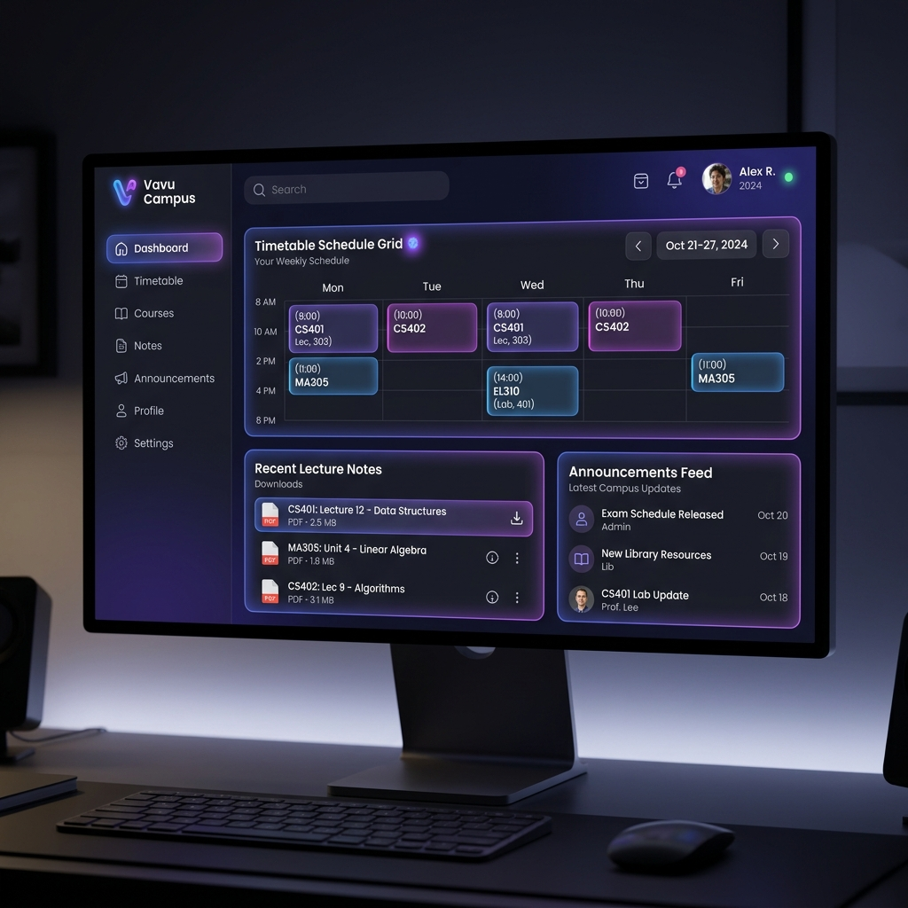
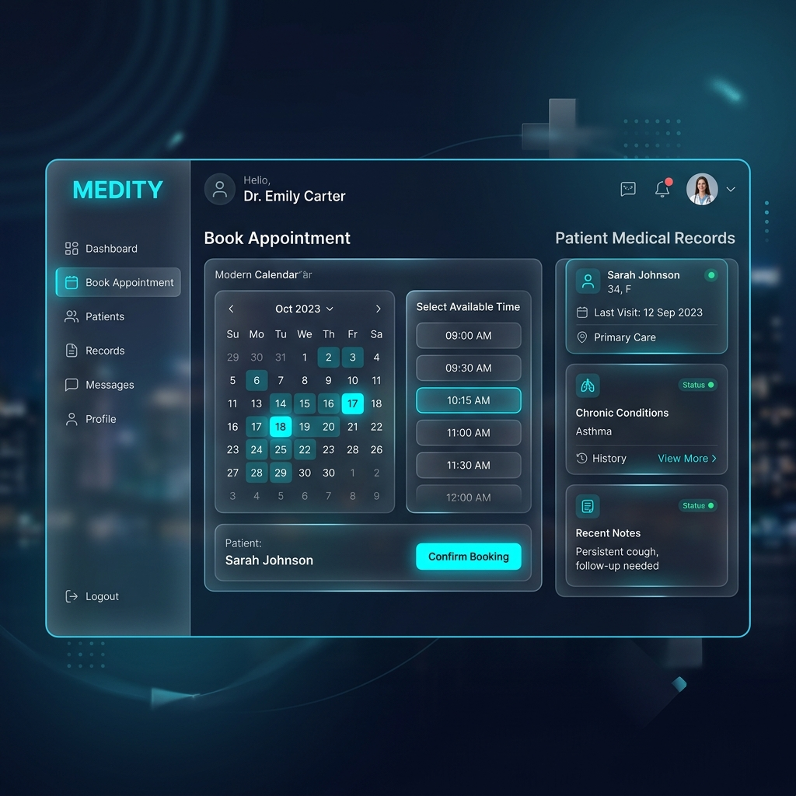
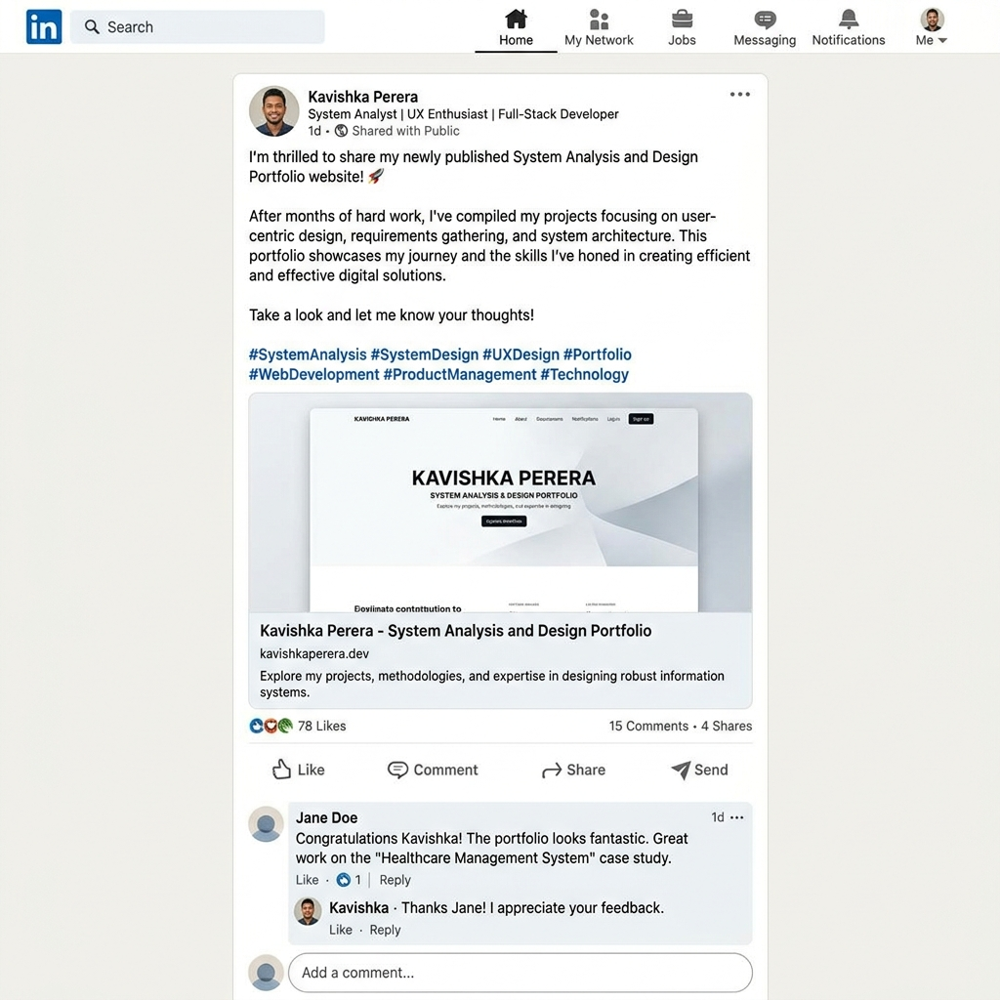

<!DOCTYPE html>
<html lang="en">

<head>
    <meta charset="UTF-8">
    <meta name="viewport" content="width=device-width, initial-scale=1.0">
    <title>Shehan Hirusha | Android Application Developer</title>
    <meta name="description"
        content="Professional System Analysis and Design (SAD) portfolio website of Shehan Hirusha, ICT Undergraduate at University of Vavuniya. Software Developer & System Analyst.">
    <meta name="keywords"
        content="Shehan Hirusha, SAD Portfolio, University of Vavuniya, System Analysis and Design, Full Stack Developer, Web Development">

    <!-- Design System CSS -->
    <link rel="stylesheet" href="styles.css">

    <!-- FontAwesome Icons -->
    <link rel="stylesheet" href="https://cdnjs.cloudflare.com/ajax/libs/font-awesome/6.4.0/css/all.min.css">
</head>

<body>

    <!-- Header & Navigation Bar -->
    <header class="navbar" id="navbar">
        

            <a href="#home" class="nav-logo">
                <i class="fa-solid fa-code" style="color: var(--accent-primary);"></i> ShehanH. Konara
            </a>

            <ul class="nav-links">
                <li><a href="#home" class="nav-link active">Home</a></li>
                <li><a href="#about" class="nav-link">About Me</a></li>
                <li><a href="#education" class="nav-link">Education</a></li>
                <li><a href="#skills" class="nav-link">Skills</a></li>
                <li><a href="#projects" class="nav-link">Projects</a></li>
                <li><a href="#experience" class="nav-link">Experience</a></li>
                <li><a href="#cv" class="nav-link">CV</a></li>
                <li><a href="#contact" class="nav-link">Contact</a></li>
            </ul>

            

                <button class="theme-toggle-btn" id="themeToggle" title="Toggle Light/Dark Theme">
                    <i class="fa-solid fa-moon"></i>
                </button>
                <a href="#contact" class="btn btn-primary btn-sm">Hire Me</a>
                <button class="mobile-menu-btn" id="mobileMenuBtn">
                    <i class="fa-solid fa-bars"></i>
                </button>
            

        

    </header>

    <!-- Mobile Navigation Drawer -->
    

        <button class="modal-close" id="mobileMenuClose"><i class="fa-solid fa-xmark"></i></button>
        <ul class="mobile-nav-links">
            <li><a href="#home" class="mobile-nav-link">Home</a></li>
            <li><a href="#about" class="mobile-nav-link">About Me</a></li>
            <li><a href="#education" class="mobile-nav-link">Education</a></li>
            <li><a href="#skills" class="mobile-nav-link">Skills</a></li>
            <li><a href="#projects" class="mobile-nav-link">Projects</a></li>
            <li><a href="#experience" class="mobile-nav-link">Experience</a></li>
            <li><a href="#cv" class="mobile-nav-link">CV</a></li>
            <li><a href="#contact" class="mobile-nav-link">Contact</a></li>
        </ul>
    

    <main>
        <!-- 1. HOME SECTION (HERO) -->
        <section id="home" class="hero">
            

                

                    

                        <i class="fa-solid fa-code-commit"></i> Shehan Hirusha — Android Application Developer
                    

                    <h1 class="hero-title">
                        Crafting High-Performance Android Apps with Flutter, Java &
                        Kotlin
                    </h1>
                    

                        Hello! I'm <strong>Shehan Hirusha</strong>, an ICT Undergraduate at the
                        <strong>University of Vavuniya</strong>. I specialize in building cross-platform and native
                        Android applications with clean architecture, responsive UIs, and seamless user experiences.
                    

                    

                        <a href="#projects" class="btn btn-primary"><i class="fa-solid fa-layer-group"></i> View Case
                            Studies</a>
                        <button class="btn btn-secondary" id="heroCvBtn"><i class="fa-solid fa-file-pdf"></i> View /
                            Download CV</button>
                    

                    

                        

                            <h4>3.82</h4>
                            
Current GPA

                        

                        

                            <h4>5+</h4>
                            
Android Apps Built

                        

                        

                            <h4>100%</h4>
                            
Hand-Crafted Quality

                        

                    

                

                

                    

                        
                        

                            <i class="fa-solid fa-diagram-project" style="color: var(--accent-primary);"></i> Flutter &
                            Kotlin
                        

                        

                            <i class="fa-solid fa-graduation-cap" style="color: var(--accent-secondary);"></i> ICT
                            Vavuniya
                        

                    

                

            

        </section>

        <!-- 2. ABOUT ME SECTION -->
        <section id="about" class="section">
            

                

                    <i class="fa-solid fa-user"></i> Biography
                    <h2 class="section-title">About Me</h2>
                    
Bridging theoretical System Analysis & Design principles with modern web
                        engineering.

                

                

                    

                        <h3><i class="fa-solid fa-user-gear"></i> Professional Profile</h3>
                        

                            I am a dedicated 2nd-year ICT undergraduate student at the Faculty of Technological Studies,
                            University of Vavuniya. My primary academic and technical focus centers on <strong>System
                                Analysis and Design (SAD)</strong>, modern frontend frameworks, and cloud-ready database
                            architectures.
                        

                        

                            I take pride in transforming ambiguous user requirements into well-structured UML diagrams,
                            high-fidelity wireframes, and scalable software solutions.
                        

                    

                    

                        <h3><i class="fa-solid fa-bullseye"></i> Career Objectives & Interests</h3>
                        
<strong>Primary Goal:</strong> To secure a challenging Software Engineering or Web
                            Development internship where I can apply SAD methodologies to solve real-world industry
                            problems.

                        <ul class="objective-list">
                            <li>Mastering Agile software development lifecycles and CI/CD pipelines.</li>
                            <li>Designing intuitive, accessible (WCAG AA), user-centric interfaces.</li>
                            <li>Contributing to open-source software and departmental ICT innovation.</li>
                        </ul>
                    

                

            

        </section>

        <!-- 3. EDUCATION SECTION -->
        <section id="education" class="section">
            

                

                    <i class="fa-solid fa-graduation-cap"></i> Academic Journey
                    <h2 class="section-title">Education & Highlights</h2>
                    
Academic record and relevant coursework at University of Vavuniya.

                

                

                    <!-- Education Item 1 -->
                    

                        

                        

                            2023 – Present
                            <h3>BSc (Hons) in Information & Communication Technology</h3>
                            
<strong>Faculty of Technological Studies | University of Vavuniya</strong>

                            

                                Current Cumulative GPA: <strong>3.82 / 4.00</strong> (Dean's List for Academic
                                Excellence)
                            

                            

                                System Analysis & Design
                                Web Technologies
                                DBMS & SQL
                                Data Structures & Algo
                                Software Engineering
                            

                        

                    

                    <!-- Education Item 2 -->
                    

                        

                        

                            2020 – 2022
                            <h3>G.C.E. Advanced Level (Physical Science Stream)</h3>
                            
<strong>Central College, Sri Lanka</strong>

                            

                                Passed with 3 As (Combined Mathematics, Physics, Chemistry). Z-Score: 1.845.
                            

                            

                                Mathematics
                                Physics
                                Chemistry
                            

                        

                    

                

            

        </section>

        <!-- 4. SKILLS SECTION -->
        <section id="skills" class="section">
            

                

                    <i class="fa-solid fa-code"></i> Competencies
                    <h2 class="section-title">Skills & Expertise</h2>
                    
Categorized breakdown of technical proficiencies and core soft skills.
                    

                

                

                    <button class="filter-btn active" data-skill-filter="all">All Skills</button>
                    <button class="filter-btn" data-skill-filter="frontend">Frontend & Web</button>
                    <button class="filter-btn" data-skill-filter="sad">SAD & Modeling</button>
                    <button class="filter-btn" data-skill-filter="tools">Database & Tools</button>
                    <button class="filter-btn" data-skill-filter="soft">Soft Skills</button>
                

                

                    <!-- HTML5 / CSS3 -->
                    

                        

                            <i class="fa-brands fa-html5" style="color: #e34f26;"></i> HTML5 &
                                CSS3
                            95%
                        

                        

                            

                        

                    

                    <!-- JavaScript -->
                    

                        

                            <i class="fa-brands fa-js" style="color: #f7df1e;"></i> JavaScript
                                (ES6+)
                            90%
                        

                        

                            

                        

                    

                    <!-- React.js -->
                    

                        

                            <i class="fa-brands fa-react" style="color: #61dafb;"></i>
                                React.js / Vite
                            85%
                        

                        

                            

                        

                    

                    <!-- UML & SAD -->
                    

                        

                            <i class="fa-solid fa-diagram-project"
                                    style="color: var(--accent-primary);"></i> UML & SAD Diagrams
                            92%
                        

                        

                            

                        

                    

                    <!-- Requirements Spec -->
                    

                        

                            <i class="fa-solid fa-file-contract"
                                    style="color: var(--accent-secondary);"></i> Requirements Eng (FR/NFR)
                            90%
                        

                        

                            

                        

                    

                    <!-- Database -->
                    

                        

                            <i class="fa-solid fa-database" style="color: #336791;"></i> MySQL
                                & PostgreSQL
                            88%
                        

                        

                            

                        

                    

                    <!-- Git / GitHub -->
                    

                        

                            <i class="fa-brands fa-github"></i> Git & Version Control
                            88%
                        

                        

                            

                        

                    

                    <!-- Analytical Thinking -->
                    

                        

                            <i class="fa-solid fa-brain"
                                    style="color: var(--accent-primary);"></i> Analytical Problem Solving
                            94%
                        

                        

                            

                        

                    

                

            

        </section>

        <!-- 5. PROJECTS SECTION -->
        <section id="projects" class="section">
            

                

                    <i class="fa-solid fa-laptop-code"></i> Case Studies
                    <h2 class="section-title">Featured Projects</h2>
                    
Real-world applications engineered following full System Analysis &
                        Design lifecycles.

                

                

                    <!-- Project 1: AgriConnect -->
                    

                        

                            
                            Full-Stack / SAD
                        

                        

                            <h3 class="project-title">AgriConnect</h3>
                            

                                <strong>Problem:</strong> Local agricultural producers faced market information gaps and
                                supply chain delays when connecting with buyers in Sri Lanka.
                            

                            

                                <strong>My Contribution:</strong> Lead System Analyst & Frontend Developer. Created full
                                UML Use-Case & Activity diagrams, designed interactive yield pricing dashboard.
                            

                            

                                HTML5/CSS3
                                JavaScript
                                Node.js
                                UML
                            

                            

                                <button class="btn btn-secondary btn-sm open-modal-btn" data-project="agriconnect"><i
                                        class="fa-solid fa-eye"></i> Details</button>
                                <a href="https://github.com/shehanhirusha/AgriConnect" target="_blank"
                                    class="btn btn-primary btn-sm"><i class="fa-brands fa-github"></i> GitHub</a>
                            

                        

                    

                    <!-- Project 2: VavuCampus -->
                    

                        

                            
                            Web Portal
                        

                        

                            <h3 class="project-title">VavuCampus Portal</h3>
                            

                                <strong>Problem:</strong> Fragmented lecture resource sharing and schedule conflict
                                handling across ICT department streams.
                            

                            

                                <strong>My Contribution:</strong> Designed system wireframes, timetable conflict
                                resolution logic, and note-sharing REST API.
                            

                            

                                React.js
                                Vite
                                Express
                                PostgreSQL
                            

                            

                                <button class="btn btn-secondary btn-sm open-modal-btn" data-project="vavucampus"><i
                                        class="fa-solid fa-eye"></i> Details</button>
                                <a href="https://github.com/shehanhirusha/VavuCampus" target="_blank"
                                    class="btn btn-primary btn-sm"><i class="fa-brands fa-github"></i> GitHub</a>
                            

                        

                    

                    <!-- Project 3: Medity -->
                    

                        

                            
                            UI/UX & Web
                        

                        

                            <h3 class="project-title">Medity Health System</h3>
                            

                                <strong>Problem:</strong> Inefficient appointment scheduling leading to extended waiting
                                times in regional healthcare outpatient clinics.
                            

                            

                                <strong>My Contribution:</strong> Conducted requirements specification (FR1-FR5), built
                                responsive booking UI with glassmorphism aesthetics.
                            

                            

                                JavaScript
                                CSS
                                LocalStorage
                                Wireframing
                            

                            

                                <button class="btn btn-secondary btn-sm open-modal-btn" data-project="medity"><i
                                        class="fa-solid fa-eye"></i> Details</button>
                                <a href="https://github.com/shehanhirusha/Medity" target="_blank"
                                    class="btn btn-primary btn-sm"><i class="fa-brands fa-github"></i> GitHub</a>
                            

                        

                    

                

            

        </section>

        <!-- 6. EXPERIENCE & ACTIVITIES SECTION -->
        <section id="experience" class="section">
            

                

                    <i class="fa-solid fa-users"></i> Engagement
                    <h2 class="section-title">Leadership & Activities</h2>
                    
Volunteering, departmental roles, competitions, and technical
                        achievements.

                

                

                    

                        <h3 class="exp-role">Executive Committee Member</h3>
                        
ICT Student Circle, University of Vavuniya

                        
2024 – Present

                        
Co-organized departmental technical workshops, GitHub training sessions, and annual hackathon
                            logistical planning.

                    

                    

                        <h3 class="exp-role">Hackathon Finalist</h3>
                        
National Smart Cities Hackathon 2024

                        
2024

                        
Engineered a working web prototype for urban waste tracking within 24 hours under intense
                            competition constraints.

                    

                    

                        <h3 class="exp-role">Peer Tutor (Web Dev & Git)</h3>
                        
Faculty of Technological Studies

                        
2023 – 2024

                        
Mentored 40+ first-year ICT students in basic HTML5/CSS3 styling, Git repository workflow,
                            and simple JS scripting.

                    

                

                <!-- LinkedIn Career Sharing Evidence Section -->
                

                    

                        <i class="fa-brands fa-linkedin" style="font-size: 2.2rem; color: #0a66c2;"></i>
                        

                            <h3 style="font-size: 1.2rem;">LinkedIn Portfolio Post & Featured Evidence</h3>
                            
Demonstrating career promotion &
                                professional web presence (Assignment Requirement #6).

                        

                    

                    

                        "Excited to share my System Analysis and Design (SAD) Professional Portfolio website! Built from
                        the ground up featuring UML specifications, responsive UI, and full project case studies. Check
                        out the live URL and GitHub source!"
                    

                    <a href="https://www.linkedin.com/in/shehan-hirusha-33bb52411?utm_source=share_via&utm_content=profile&utm_medium=member_android"
                        target="_blank"
                        style="display: inline-flex; align-items: center; gap: 0.4rem; margin-top: 0.65rem; font-weight: 600; color: var(--accent-primary);">
                        <i class="fa-solid fa-arrow-up-right-from-square"></i> View Shehan Hirusha's LinkedIn Profile
                    </a>
                    
                

            

        </section>

        <!-- 7. CV SECTION -->
        <section id="cv" class="section">
            

                

                    <i class="fa-solid fa-file-pdf cv-icon"></i>
                    <h2 class="section-title">Curriculum Vitae</h2>
                    

                        View or download an updated, comprehensive copy of my professional CV in PDF format.
                    

                    

                        <button class="btn btn-primary" id="openCvModalBtn"><i class="fa-solid fa-expand"></i> Preview
                            CV Online</button>
                        <a href="CV_Shehan_Hirusha.pdf" download="CV_Shehan_Hirusha.pdf" class="btn btn-secondary"><i
                                class="fa-solid fa-download"></i> Download CV (PDF)</a>
                    

                

            

        </section>

        <!-- 8. CONTACT & LINKS SECTION -->
        <section id="contact" class="section">
            

                

                    <i class="fa-solid fa-paper-plane"></i> Get In Touch
                    <h2 class="section-title">Contact & Professional Links</h2>
                    
Feel free to reach out for internship opportunities, project
                        collaborations, or inquiries.

                

                

                    

                        <h3 style="margin-bottom: 1.5rem; color: var(--accent-primary);">Contact Information</h3>

                        

                            
<i class="fa-solid fa-envelope"></i>

                            

                                <h4>Email Address</h4>
                                <a href="mailto:shehan.hirusha@vau.ac.lk">shehan.hirusha@vau.ac.lk</a>
                            

                        

                        

                            
<i class="fa-solid fa-location-dot"></i>

                            

                                <h4>Institution Location</h4>
                                
Faculty of Technological Studies, University of Vavuniya,
                                    Sri Lanka

                            

                        

                        

                            
<i class="fa-brands fa-linkedin"></i>

                            

                                <h4>LinkedIn Profile</h4>
                                <a href="https://www.linkedin.com/in/shehan-hirusha-33bb52411?utm_source=share_via&utm_content=profile&utm_medium=member_android"
                                    target="_blank">linkedin.com/in/shehan-hirusha-33bb52411</a>
                            

                        

                        

                            
<i class="fa-brands fa-github"></i>

                            

                                <h4>GitHub Repository</h4>
                                <a href="https://github.com/shehanhirusha" target="_blank">github.com/shehanhirusha</a>
                            

                        

                    

                    <form class="glass-card contact-form" id="contactForm">
                        <h3 style="margin-bottom: 0.5rem; color: var(--text-primary);">Send a Message</h3>

                        

                            <label for="name">Your Name *</label>
                            <input type="text" id="name" class="form-input" placeholder="e.g. Dr. John Doe" required>
                        

                        

                            <label for="email">Your Email *</label>
                            <input type="email" id="email" class="form-input" placeholder="e.g. john@example.com"
                                required>
                        

                        

                            <label for="subject">Subject *</label>
                            <input type="text" id="subject" class="form-input" placeholder="e.g. Internship Inquiry"
                                required>
                        

                        

                            <label for="message">Message *</label>
                            <textarea id="message" class="form-input" placeholder="Write your message here..."
                                required></textarea>
                        

                        <button type="submit" class="btn btn-primary"><i class="fa-solid fa-paper-plane"></i> Send
                            Message</button>
                    </form>
                

            

        </section>
    </main>

    <!-- Project Detail Modal Reader -->
    

        

            <button class="modal-close" id="modalClose"><i class="fa-solid fa-xmark"></i></button>
            

                <!-- Injected via JavaScript -->
            

        

    

    <!-- CV Interactive Preview Modal -->
    

        

            <button class="modal-close" id="cvModalClose"><i class="fa-solid fa-xmark"></i></button>
            <h3 style="margin-bottom: 1rem; color: var(--accent-primary);">CV Document Preview</h3>
            <iframe src="CV_Shehan_Hirusha.pdf"
                style="width: 100%; height: calc(100% - 60px); border: none; border-radius: var(--radius-md);"></iframe>
        

    

    <!-- Toast Notification Container -->
    

    <!-- Footer -->
    <footer class="footer">
        

            
&copy; 2026 Shehan Hirusha | System Analysis & Design Individual Assignment | University of Vavuniya

            
Hand-crafted with HTML5, CSS3
                Custom Properties, Vanilla JavaScript & SAD Principles.

        

    </footer>

    <!-- Interactive JavaScript -->
    
</body>

</html>